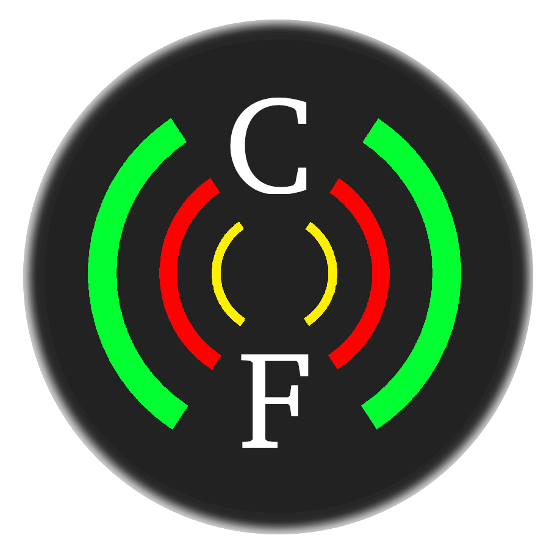

# cablera-federal 
Repositorio principal proyecto Cablera Federal

### Alumnos:
Gutierrez Darío, López Sebastián.

### Objetivo del proyecto: 
Proveer una plataforma que sea capaz de utilizar diferentes apis (Facebook,Twitter,Instagram) o RSS provenientes de un sitio web y recopilar información de noticias para luego permitir centralizar, ordenar, filtrar, taguear o citar estas noticias.

### Motivación del proyecto:
El proyecto surge a partir de la dificultad que tienen diferentes medios pequeños para conseguir informacion fuera de su zona de alcance.

### Stack tecnologico

* #### Backend  
 
  Laravel 5.5  
  PHP 7.0  
  MySQL  
  ElasticSearch
  
* #### Frontend

  Angular 6
  
Url Backend: https://github.com/sennedjem/cablera-federal-backend  
Url Frontend: https://github.com/sennedjem/cablera-federal-frontend
